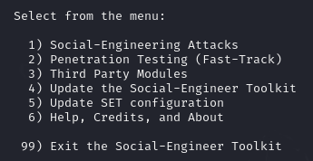
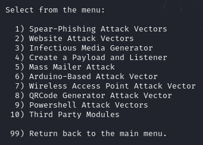
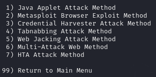
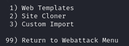
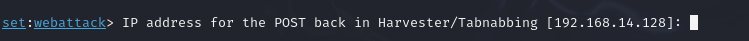
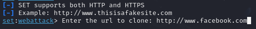
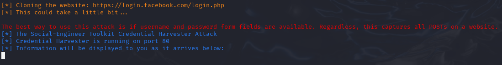

# dio-bc
DIO Cybersecurity Boot Camp

## Este repositório contém os desafios práticos desenvolvidos durante o aprendizado

### Ferramentas utilizadas
- S.O Kali Linux
- setoolkit

## Como criar um site clonado para roubar credenciais
- Altere para o modo privilegiado "root": ```sudo su ```
- Execute a ferramenta SEToolkit: ```setoolkit ```
- Selecione o Tipo de ataque: ```1) Social-Engineering Attacks ```
- 

- Selecione o Vetor de ataque: ```2) Web Site Attack Vectors ```
- 

- Selecione o Método de ataque: ```3) Credential Harvester Attack Method ```
- 
  
- Selecione o Método: ```2) Site Cloner ```
- 
  
- Aperte enter para confirmar o uso do IP local da VM:
- 

- Adicione uma URL para clonar a página
- Ex: ```http://www.facebook.com```
- 

- 

### Em uma máquina 'cobaia', faça o acesso no navegador busacando pelo IP configurado


### Resutados


